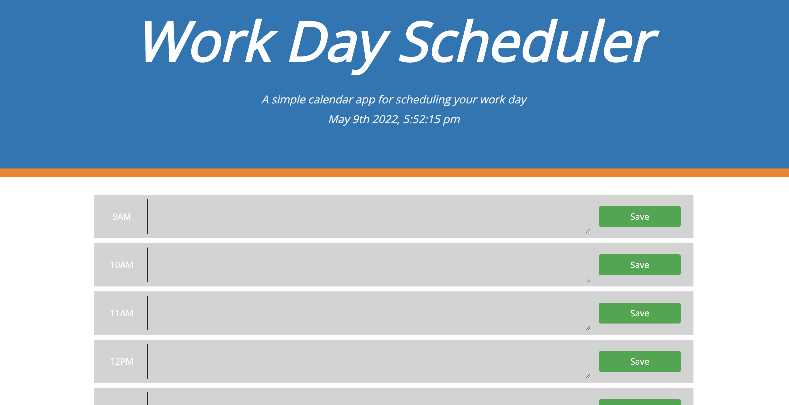

# Day-Planner

This project was designed to help you stay organized during your work day for each day.

# Project prerequisites:

A simple calendar application that allows the user to save events for each hour of the day. The app displays standard business hours, an input field which changes color depending on the current time and save button. Each hour is coded to reflect on, whether the time slot is in the past, the present, or the future. Additionally, the app displays the current day and date at the top of the page.

Technologies used:

. HTML

. CSS

. Javascript

. Bootstrap

. local storage

. jQuery

. moment.js

. Fontawesome

# Screenshot of the app:

